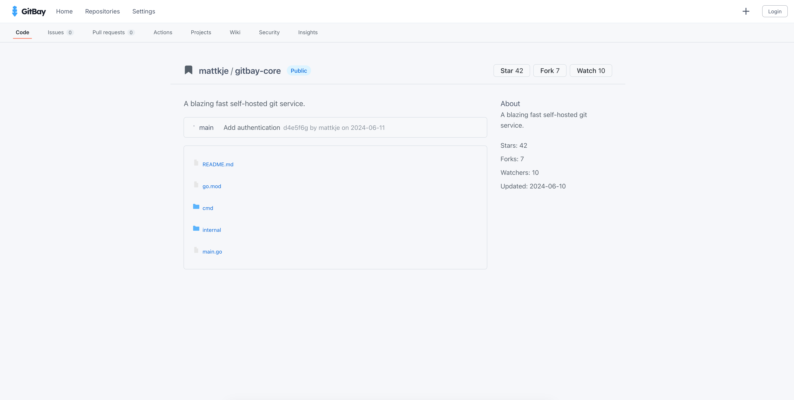

  

<h1 align="center">GitBay</h1>

*GitBay* is a minimal Gitea-like repository manager built with Go.

---

## Note
Very early stage, not much here now.

## Technologies

- Go (backend)
- Vue.js (frontend)
- TypeScript & JavaScript
- npm
- Git

## Screenshots

